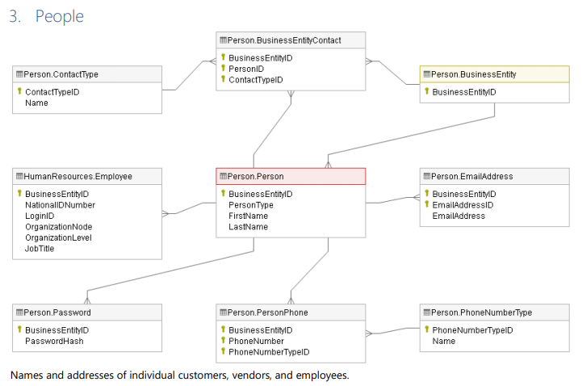
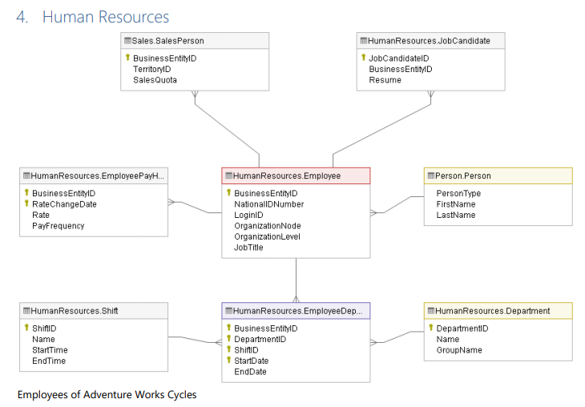

# Adventure Works Cycles - Person & Human Resources

Pracujeme s databázemi **AdventureWorks2019** a **AdventureWorksDW2019**, které
shromažďují data o fiktivním nadnárodním výrobci jízdních kol Adventure
Works Cycles. Tato firma vznikla v roce 2010.

Data je potřeba kontrolovat, protože jsou na jejich základě tvořena
důležitá byznysová rozhodnutí.

Šéfové jednotlivých oddělení byli požádáni, aby sepsali požadavky, která
mají data splňovat.

V části A jsou sepsány požadavky na Smoke testy, v části B jsou
požadavky na integrační testy pro tabulky v databázi AdventureWorks2019
a Dim tabulky v databázi AdventureWorksDW2019, a nakonec v části C jsou
zadání pro tabulky v databázi AdventureWorks2019 a Fact tabulky v
databázi AdventureWorksDW2019.

Na konci dokumentu můžete najít informace o tabulkách v
AdventureWorks2019.

Tento soubor obsahuje testy pro oddělení Person a Human Resources.

## A)  Smoke testy

| Testovací požadavek  | Název tabulky v databázi AdventureWorks2019  | Query  |
|-|-|-|
|Každý zaměstnanec (PersonType 'EM') musí mít vyplněný mail (sloupec EmailAddress)| [Person].[Person], join [Person].[EmailAddress] | SELECT P.FirstName, P.LastName, E.EmailAddress FROM [Person].[Person] P JOIN [Person].[EmailAddress] E ON E.BusinessEntityID = P.BusinessEntityID WHERE P.PersonType = 'EM' AND E.EmailAddress IS NULL |
|AddressLine1 nesmí obsahovat NULL hodnoty| [Person].[Address]| |
|Tabulka BusinessEntity nesmí být prázdná| [Person].[BusinessEntity] | |
Každý mail ve sloupci EmailAddress musí obsahovat @ a musí končit na .com | [Person].[EmailAddress] | |
VacationHours kazdeho zamestnance nesmi presahovat 100 | [HumanResources].[Employee] | |
|Sick leave kazdeho zamestnance nesmi presahovat 80 | [HumanResources].[Employee] | |
|PayFrequency musí mít pouze hodnoty 1 nebo 2 | [HumanResources].[EmployeePayHistory] | |
|StartDate a EndDate nesmí obsahovat hodnoty starší než z roku 2010 | [HumanResources].[EmployeeDepartmentHistory] | |
|StartDate musí být starší datum než EndDate | [HumanResources].[EmployeeDepartmentHistory] | |

## B)  Integrační testy pro Dim tabulky

 | Testovací požadavek  | Tabulka v AdventureWorks2019 | Tabulka v AdventureWorksDW2019 | Query AdventureWorks2019 | Query AdventureWorksDW2019 |
|-|-|-|-|-|
|Job Title v tabulce Employee musí mít stejné hodnoty jako Title v tabulce DimEmployee| [HumanResources].[Employee]  | [dbo].[DimEmployee] | | |
|Job Title a LoginID v tabulce Employee musí mít stejné hodnoty jako Title a LoginID v tabulce DimEmployee, použijte HASH funkci | [HumanResources].[Employee] | [dbo].[DimEmployee] | | |                               

## C)  Integrační testy pro Fact tabulky

| Testovací požadavek  | Tabulka v AdventureWorks2019 | Tabulka v AdventureWorksDW2019 | Query AdventureWorks2019 | Query AdventureWorksDW2019 | Poznámka |
|-|-|-|-|-|-|
|Součet LineTotal pro internetové objednávky v tabulce SalesOrderDetail musí být stejný jako součet SalesAmount v tabulce FactInternetSales| [Sales].[SalesOrderHeader], join [Sales].[SalesOrderDetail] | [dbo].[FactInternetSales] | SELECT SUM(D.LineTotal) FROM [Sales].[SalesOrderHeader] H JOIN Sales.SalesOrderDetail D ON D.SalesOrderID = H.SalesOrderID WHERE H.OnlineOrderFlag = 1; | SELECT SUM(SalesAmount) AS TotalOnlineSales FROM [dbo].[FactInternetSales]; | Tabulka SalesOrderDetail se musí spojit se SalesOrderHeader, internetové objednávky indikuje hodnota 1 ve sloupci OnlineOrderFlag |
|Počet řádků internetových objednávek v tabulce SalesOrderDetail se musí rovnat počtu řádků v tabulce FactInternetSales | [Sales].[SalesOrderHeader], join [Sales].[SalesOrderDetail] | [dbo].[FactInternetSales] | | | Tabulka SalesOrderDetail se musí spojit se SalesOrderHeader, internetové objednávky indikuje hodnota 1 ve sloupci OnlineOrderFlag |
|Součet sloupce LineTotal za jednotlivé oblasti (internetové objednávky) musí být stejný jako součet SalesAmount v tabulce FactInternetSales za jednotlivé oblasti | [Sales].[SalesOrderHeader], join [Sales].[SalesOrderDetail], join [Sales].[SalesTerritory] | [dbo].[FactInternetSales], join [dbo].[DimSalesTerritory] | SELECT T.Name, SUM(D.LineTotal) AS SumLineTotal FROM [Sales].[SalesOrderHeader] H JOIN Sales.SalesOrderDetail D ON D.SalesOrderID = H.SalesOrderID JOIN Sales.SalesTerritory T ON T.TerritoryID = H.TerritoryID WHERE H.OnlineOrderFlag = 1 GROUP BY T.Name ORDER BY T.Name; | SELECT T.SalesTerritoryRegion, SUM(S.SalesAmount) AS SumSalesAmount FROM [dbo].[FactInternetSales] S JOIN dbo.DimSalesTerritory T ON T.SalesTerritoryKey = S.SalesTerritoryKey GROUP BY T.SalesTerritoryRegion ORDER BY T.SalesTerritoryRegion; | Tabulka SalesOrderDetail se musí spojit se SalesOrderHeader, internetové objednávky indikuje hodnota 1 ve sloupci OnlineOrderFlag. Oblasti najdete ve sloupci Name v tabulce Sales.SalesTerritory a ve sloupci SalesTerritoryRegion v dbo.DimSalesTerritory | 
|Součet sloupce LineTotal podle příjmení obchodníků (internetové objednávky) musí být stejný jako součet SalesAmount v tabulce FactInternetSales za jednotlivé obchodníky | [Sales].[SalesOrderDetail], join [Sales].[SalesOrderHeader], join [Sales].[SalesPerson], join [Person].[Person] (LastName) | [dbo].[FactInternetSales], join [dbo].[DimEmployee] group by LastName | | | Tabulka SalesOrderDetail se musí spojit se SalesOrderHeader, internetové objednávky indikuje hodnota 1 ve sloupci OnlineOrderFlag. Dále se musí spojit tabulka SalesPerson a následně Person, kde najdete LastName |

## Přehled tabulek v databázi AdventureWorks2019

  |Person.Address                            |Street address information for customers, employees, and vendors.|
  |-|-|
  |Person.AddressType                         |Types of addresses stored in the Address table.
  |Person.BusinessEntity                      |Source of the ID that connects vendors, customers, and employees with address and contact information.
  |Person.BusinessEntityAddress               |Cross-reference table mapping customers, vendors, and employees to their addresses
  |Person.BusinessEntityContact               |Cross-reference table mapping stores, vendors, and employees to people
  |Person.ContactType                         |Lookup table containing the types of business entity contacts.
  |Person.CountryRegion                       |Lookup table containing the ISO standard codes for countries and regions.
  |Person.EmailAddress                        |Where to send a person email.
  |Person.Password                            |One way hashed authentication information
  |Person.Person                              |Human beings involved with AdventureWorks: employees, customer contacts, and vendor contacts.
  |Person.PersonPhone                         |Telephone number and type of a person.
  |Person.PhoneNumberType                     |Type of phone number of a person.
  |Person.StateProvince                       |State and province lookup table.
  |HumanResources.Department                  |Lookup table containing the departments within the Adventure Works Cycles company.
  |HumanResources.Employee                    |Employee information such as salary, department, and title.
  |HumanResources.EmployeeDepartmentHistory   |Employee department transfers.
  |HumanResources.EmployeePayHistory          |Employee pay history
  |HumanResources.JobCandidate                |Résumés submitted to Human Resources by job applicants.
  |HumanResources.Shift                       |Work shift lookup table

## Schéma tabulek v databázi AdventureWorks2019

## Schéma tabulek v databázi AdventureWorksDW2019

